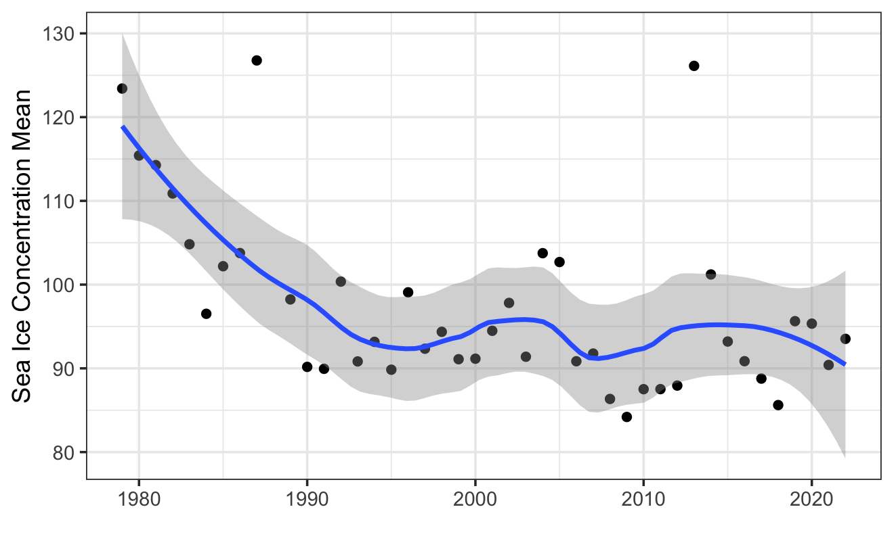

```{r setup, include=FALSE}
rm(list = ls())
knitr::opts_chunk$set(echo = TRUE,
                      message = FALSE)
```

# BACKGROUND

When describing these time series, we have used words such as “trend” and “seasonal” which need to be defined more carefully.

Trend
A trend exists when there is a long-term increase or decrease in the data. It does not have to be linear. Sometimes we will refer to a trend as “changing direction”, when it might go from an increasing trend to a decreasing trend, like this figure; 
```{r plot, echo=FALSE, fig.cap="SIC Trend", out.width = '60%'}

```


Seasonal
A seasonal pattern occurs when a time series is affected by seasonal factors such as the time of the year or the day of the week. Seasonality is always of a fixed and known period. 

All this analysis are do to SubArea 48.1 in the Southern Ocean.

# OBJECTIVE

To condition an operational model in krill, the chosen environmental component must have an associated error (variance) to be incorporated, which gives more reliability to the projection of the population variables.

```{r}
library(here)
library(tidyverse)
library(tsibble)
library(zoo)
library(feasts)
library(kableExtra)
library(CCAMLRGIS)
```

Read data. This data is from another  analysis with raster layer from satellite sources.

```{r}
load("DataEnvKrill2.RData")
# ls()
#cargo objeto
```


```{r}
dtats <- get("dataenvf2")
```


## Time Series SIC

Data wrangling to clean it, becauso have different structure and `NA`, wich is not supported.

```{r}
dtats1 <- dtats %>% 
  select(1,2,4,6) %>% 
  mutate(ANOn =as.numeric(ANO)) %>% 
  drop_na(ANOn)
```

Change `dtats1` from `data.frame`to `ts` object.

```{r}
ts_obj <- ts(dtats1$meansic, 
             start = c(dtats1$ANOn[1], 1), 
             end = c(dtats1$ANOn[length(dtats1$ANOn)], 12), 
             frequency = 12)

ts_tbobj <- as_tsibble(ts_obj)
```

A subseries plot to show difference.

```{r}
ts_tbobj |>
  gg_subseries(value) +
  labs(
    y = "SIC",
    title = "SIC SubArea 48.1"
  )+
  theme_bw()
```
### Autocorrelacion

An `scaterplot` of correlation simple bettwen lags. We select 60 lags, to get entire series of SIC.

```{r}
ts_tbobj %>% 
  gg_lag(value, 
         geom="point",
         lags = 1:12)

ts_tbobj |> 
  ACF(value, lag_max = 60) %>% 
  autoplot() +
  labs(title = "Autocorrelacion de SIC in 48.1")+
  theme_bw()

```

We then describe a trend correlation and also a seasonal one, which is very characteristic of environmental data.

### Descomposicion

In this chapter, we consider the most common methods for extracting these components from a time series. Often this is done to help improve understanding of the time series, but it can also be used to improve forecast accuracy.

When decomposing a time series, it is sometimes helpful to first transform or adjust the series in order to make the decomposition (and later analysis) as simple as possible. So we will begin by discussing transformations and adjustments.

```{r}
dcmp <- ts_tbobj|>
  model(stl = STL(value))

```


otra manera de edescomponer y forecast 
```{r}
descomsic <- decompose(ts_obj)
#autoplot(descomsic)
acf(ts_obj)
pacf(ts_obj)
dy <-diff(ts_obj)
print(modeloarsic <- forecast::auto.arima(ts_obj,
                                       d=1,
                                       D=1,
                                       stepwise = F,
                                       approximation = F,
                                       trace=F))
forecast::checkresiduals(modeloarsic)

fctsic <- forecast::forecast(modeloarsic, h=10, level=95)
autoplot(fctsic)+
  theme_bw()
```

```{r}
components(dcmp) |>
  as_tsibble() |>
  autoplot(value, colour="blue") +
  geom_line(aes(y=trend), colour = "#D55E00") +
  labs(
    y = "Sea Ice Concentration",
    title = "Serie de tiempo descompuesta de Sea Ice Cover en 48.1"
  ) +
  theme_bw()
```

Ahora lo descompongo en los demas componentes

```{r}
components(dcmp) |> 
  autoplot(colour="blue") +
  theme_bw()

```


### Model ARIMA

```{r}
train <- dtats$meansic[1:40]
test <- dtats$meansic[40:43]

model1 <- arima(train, order =c(1,2,1))

predo <- forecast::forecast(model1, h=10)
plot(predo)
```

## Moving Average. 

```{r eval=FALSE}
mov_avg <- zoo::rollmean(dtats1$meansic, k=3, fill=NA)


prediction <- tail(mov_avg, n=2)

ggplot() + 
  geom_line(aes(x = as.double(dtats1$ANO), y = dtats1$meansic), 
            data = dtats, color = "blue") +
  geom_line(aes(x = as.double(dtats1$ANO), y = mov_avg), 
            data =dtats, color = "red") +
  geom_hline(yintercept = prediction, color = "green") +
  xlab("Fecha") +
  ylab("Datos") +
  ggtitle("Datos y media móvil") +
  theme_bw()
```


## Time Series TSM


Now, we use `meantsm` variable

Change `dtats1` from `data.frame`to `ts` object.

```{r}
dtats2 <- dtats1 %>% 
  filter(ANOn>1990) %>% 
  mutate(meantsm2=meantsm-270)
ts_tsm <- ts(dtats2$meantsm2, 
             start = c(dtats2$ANOn[1], 1),
             end = c(dtats2$ANOn[length(dtats2$ANOn)], 12),
             frequency = 12)

ts_tsm2 <- as_tsibble(ts_tsm)
```

A subseries plot to show difference.

```{r}
ts_tsm2 |>
  gg_subseries(value) +
  labs(
    y = "TSM",
    title = "TSM SubArea 48.1"
  )+
  theme_bw()
```
### Autocorrelacion


An `scaterplot` of correlation simple bettwen lags. We select 60 lags, to get entire series of SIC.


```{r}
ts_tsm2 %>% 
  gg_lag(value, 
         geom="point",
         lags = 1:12)

ts_tsm2 |> 
  ACF(value, lag_max = 60) %>% 
  autoplot() +
  labs(title = "Autocorrelacion de TSM in 48.1")+
  theme_bw()

```

We then describe a trend correlation and also a seasonal one, which is very characteristic of environmental data.

### Descomposicion

In this chapter, we consider the most common methods for extracting these components from a time series. Often this is done to help improve understanding of the time series, but it can also be used to improve forecast accuracy.

When decomposing a time series, it is sometimes helpful to first transform or adjust the series in order to make the decomposition (and later analysis) as simple as possible. So we will begin by discussing transformations and adjustments.

```{r}
dcmptsm <- ts_tsm2|>
  model(stl = STL(value))

```


```{r}
components(dcmptsm) |>
  as_tsibble() |>
  autoplot(value, colour="red") +
  geom_line(aes(y=trend), colour = "black") +
  labs(
    y = "TSM",
    title = "Serie de tiempo descompuesta de TSM Cover en 48.1"
  ) +
  theme_bw()
```

Ahora lo descompongo en los demas componentes

```{r}
components(dcmptsm) |> 
  autoplot(colour="red") +
  theme_bw()

```


otra manera de descomponer y forecast 
```{r}
descom <- decompose(ts_tsm)
autoplot(descom)
acf(ts_tsm)
pacf(ts_tsm)
dy <-diff(ts_tsm)
print(modeloar <- forecast::auto.arima(ts_tsm,
                                       d=1,
                                       D=1,
                                       stepwise = F,
                                       approximation = F,
                                       trace=F))
forecast::checkresiduals(modeloar)

fct <- forecast::forecast(modeloar, h=10, level=95)
autoplot(fct)+
  theme_bw()
```

### Model ARIMA

```{r}
traintsm <- dtats2$meantsm2[1:32]
testtsm <- dtats$meansic[33:40]

modeltsm <- arima(traintsm, order =c(1,2,1))

predotsm <- forecast::forecast(modeltsm, h=10)
plot(predotsm)
```

## Moving Average. 

```{r eval=FALSE}
mov_avgtsm <- zoo::rollmean(dtats2$meantsm2, k=3, fill=NA)


predictiontsm <- tail(mov_avgtsm, n=5)

ggplot() + 
  geom_line(aes(x = dtats2$ANOn, y = dtats2$meantsm2), 
            data = dtats, color = "blue") +
  geom_line(aes(x = dtats2$ANOn, y = mov_avgtsm), 
            data =dtats, color = "red") +
  geom_hline(yintercept = predictiontsm[1], color = "green") +
  xlab("Fecha") +
  ylab("Datos") +
  ggtitle("Datos y media móvil") +
  theme_bw()
```


